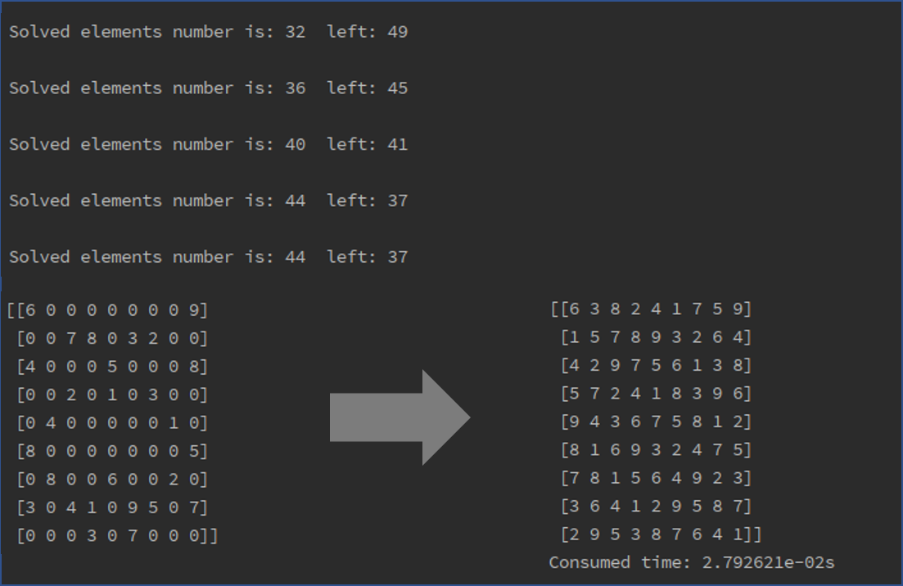

# shudu
解决数独问题

## 逻辑步
- 采用三个逻辑，行、列、块里面不能有重复数据，生成每个位置的可能填的数的列表
- 行、列、块中必须存在1-9所有的数，依据这个逻辑求解一些对象
- 迭代这两个步骤，缩小可能性的搜索空间 <code>self.pool</code>

## 迭代步
- 回溯算法：遍历每一个可能性，<code>is_valid==True</code>就计算下一个位置，否则尝试下一个可能性，如果都不可以，则退回到上一步

## Solutions
问题来自于Ubuntu应用中的数独游戏

